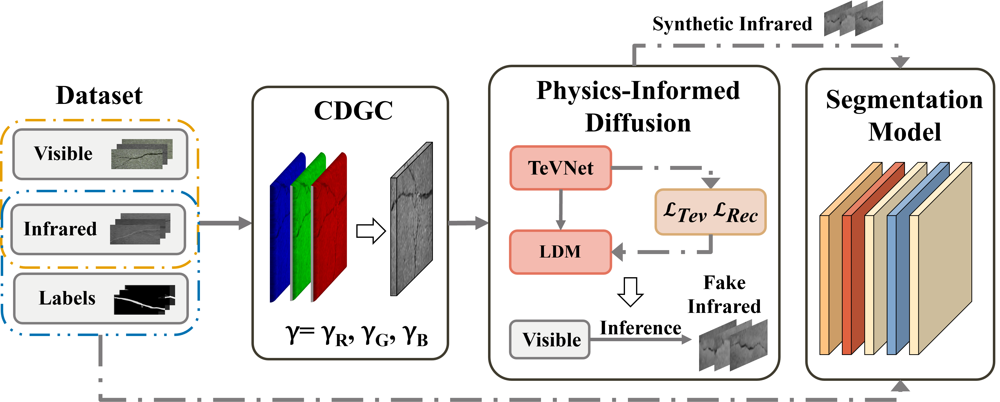

# Physics-Informed-Diffusion-Model-CDGC
This repo is the official implementation of "Visible-to-Infrared Domain Translation of Pavement Crack Images by A Physics-Informed Diffusion Model"


## Environment

We recommend you to install the environment with environment.yaml. 

```bash
conda env create --file=environment.yml
```

## Datasets

The datasets for training the physics-informed diffusion model to generate synthetic infrared images can be downloaded at: [Insert dataset download link here]

The datasets for testing the segmentation model can be downloaded at: [Insert dataset download link here]

## Checkpoint

The pretrained physics-informed diffusion model for generating synthetic infrared images can be downloaded at: [Insert model download link here]

The pretrained segmentation model for testing the crack segmentation performance can be downloaded at: [Insert model download link here]

## CDGC Test
Use the shellscript to present the performance of CDGC module
```sh
bash shell/CDGC.sh
```
## Synthetic lwir imgs Evalutation

Use the shellscript to evaluate. `indir` is the input directory of visible RGB images, `outdir` is the output directory of translated infrared images,  We prepare some RGB images in `dataset/CDGC` for quick evaluation.

```sh
bash shell/run_test.sh
```

###  Evaluate the preformance
```bash
bash shell/eval.sh
```

## Train Physics-Informed-Diffusion 

### Dataset preparation

Prepare corresponding RGB and infrared images with same names in two directories.

### Stage 1: TeVNet

#### Train TeVNet
```bash
bash TeVNet/shell/train.sh
```

#### Test TeVNet or output TeV decomposition variables.

```sh
bash TeVNet/shell/test_vnums4.sh
```

#### TeV -> HSV images

```sh
bash TeVNet/shell/test_tev2hsv.sh
```

### Stage 2: Train AutoEncoder

Use the shellscript to train Autoencoder. 

```bash
bash shell/run_train_1st.sh
```

### Stage 3: Train Physics-Informed-Diffusion

Use the shellscript to train. 

```bash
bash shell/run_train.sh
```

## Unet
 
### Train

```bash
bash Unet/shell/train.sh
```

### Predict

```bash
bash Unet/shell/predict.sh
```

## Acknowledgements

Our code is built upon [LDM](https://github.com/CompVis/latent-diffusion) and [PID](https://github.com/fangyuanmao/PID). We thank the authors for their excellent work.

